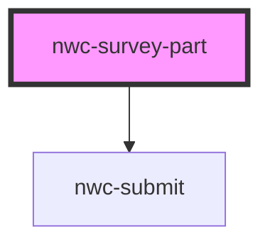

# nwc-survey-part

<!-- Auto Generated Below -->

## Properties

| Property   | Attribute  | Description | Type      | Default     |
| ---------- | ---------- | ----------- | --------- | ----------- |
| `admin`    | `admin`    |             | `boolean` | `undefined` |
| `question` | `question` |             | `string`  | `undefined` |

## Dependencies

### Depends on

- [nwc-submit](../nwc-submit)

### Graph

----------------------------------------------

*Built with [StencilJS](https://stenciljs.com/)*
